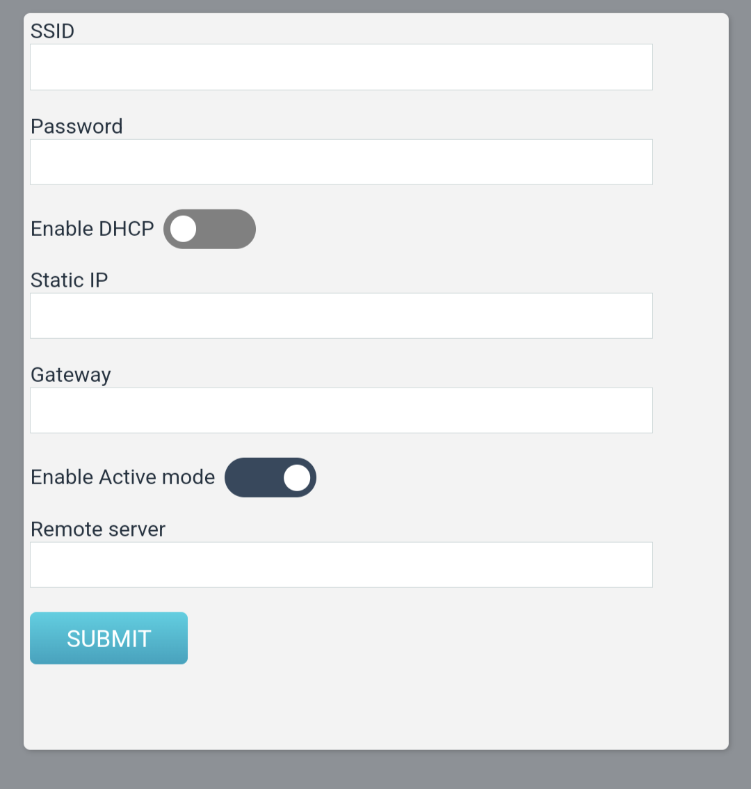
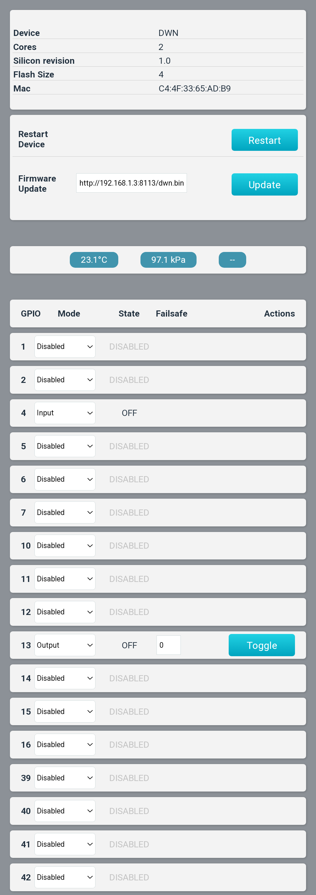

# DWN Device
This is a firmware to allow generic control of ESP32 devices. It offers an API to set GPIO modes, read inputs and toggle outputs. 

# Wifi Provision:
When booting the device, it will enter provisioning mode if any of the following condition is met:

- booting the device while holding the provision pin low (GPIO 4)
- No wifi config is found in NVS storage (new device or NVS has been erased)

During provisioning mode, the device will show up as an AP. Use a mobile device or laptop to connect to that AP and go to http://192.168.4.1.
The device will present a page where you can enter a SSID, password and static IP. All fields are mandatory.
After submiting the info, the device will switch to STA mode and connect to the provisioned AP. The webpage will redirect you
to http://<static_ip>. The page will obviously only load if the mobile/laptop is reconnected to the WAP that the esp32 device is connecting.
The webpage on the esp should now show system information.

The "active mode" allows users to provide a websocket endpoint in the "remote server" section. In this mode, the device will connect to that endpoint, and the remote server will be able to send JSONRPC commands to the device. This is to allow controlling the device behind NAT.

# Installing the software
## Create partition table
ensure you have "CONFIG_PARTITION_TABLE_TWO_OTA=y" in sdkconfig

`docker run -v /dev/ttyUSB9:/dev/ttyUSB0 --rm -it --privileged -v $(pwd):/build espressif/idf:latest idf.py partition_table-flash -p /dev/ttyUSB0`

## Build:
`docker run --rm -it --privileged -v $(pwd):/build -u $UID -w /build -e HOME=/tmp espressif/idf:latest idf.py build`

## Flash
`docker run -v /dev/ttyUSB9:/dev/ttyUSB0 --rm -it --privileged -v $(pwd):/build -w /build -e HOME=/tmp espressif/idf:latest idf.py flash monitor -p /dev/ttyUSB0`

## Erase NVS (to un-provision)
In case you need to delete the NVS data to reset to factory default.

`docker run -v /dev/ttyUSB9:/dev/ttyUSB0 --rm -it --privileged -v $(pwd):/build -w /build -e HOME=/tmp espressif/idf:latest parttool.py -p /dev/ttyUSB0 erase_partition --partition-name=nvs`

# Using the device
## Configure pins to monitor and control
The device will serve a webpage at http://device_ip/index.html

## Upgrade VIA OTA
The OTA image needs to be served by a separate webserver. The URL can then be entered in the "firware update" box. When clicking the "update" button, the device will 
try to download and install the image. This can also be done directly with the API `curl http://192.168.1.46:/jsonrpc -d '{"jsonrpc": "2.0", "method": "ota", "params": {"upgrade_url": "http://192.168.1.3:8113/dwn.bin"}, "id": "1"}'`

There is a convenience script in this repo, called `ota_flash` that will start a small web server and trigger the JSONRPC call to the device

## Temperature
Is a BME280 sensor is connected to the I2C bus (Pins 22, 23), the device will do a sample reading every 2 seconds.

## Failsafe
The "failsafe" fields on output GPIOs are a way to set a "auto-off" after a pin is toggled up. For example, setting "2" will make the pin toggle back down after 2 seconds.
This is useful if controlling a sprinkler and you want the valve to shutoff after 15min in case there is a bug in the controlling software. It can also be used for garage door openers
where the relay needs to be closed just for a short period (1 second).

## API
Delete wifi credentials and restart, dropping you in provision mode: `curl http://192.168.1.46:/jsonrpc -d '{"jsonrpc": "2.0", "method": "restart", "params": {"delete": true}, "id": "1"}'`

Restart: `curl http://192.168.1.46:/jsonrpc -d '{"jsonrpc": "2.0", "method": "restart", "params": {"delete": false}, "id": "1"}'`

Get reading from BME280: `curl http://192.168.1.46:/jsonrpc -d '{"jsonrpc": "2.0", "method": "climate", "params": {}, "id": "1"}'`

Get Status: `curl http://192.168.1.46:/jsonrpc -d '{"jsonrpc": "2.0", "method": "status", "params": {}, "id": "1"}'`

Configure pin mode: `curl http://192.168.1.46:/jsonrpc -d '{"jsonrpc": "2.0", "method": "configpins", "params": {"pins":[{"pin":16, "mode":1, "maxon":0}, {"pin":14, "mode":2, "maxon":0}]}, "id": "1"}'`

Set pin high: `curl http://192.168.1.46:/jsonrpc -d '{"jsonrpc": "2.0", "method": "setpin", "params": {"pin": 13}, "id": "1"}'`

Clear pin: `curl http://192.168.1.46:/jsonrpc -d '{"jsonrpc": "2.0", "method": "clearpin", "params": {"pin": 13}, "id": "1"}'`

More information can be found in [api.c](main/api.c)